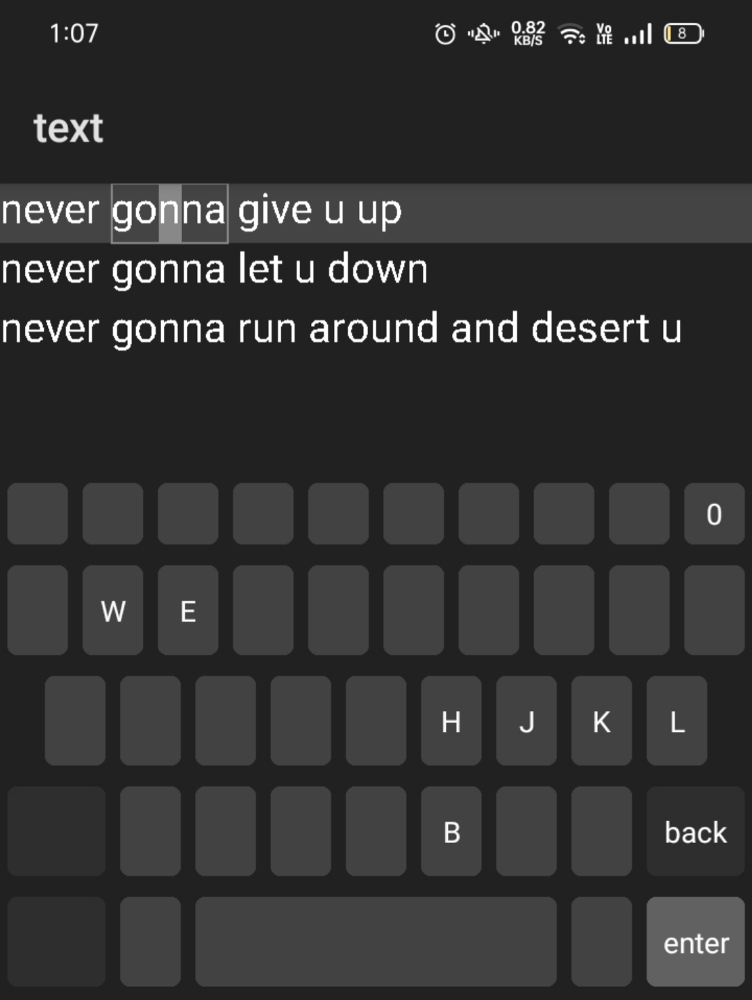

# text 🗒️

a code editor project made in Android Studio and AIDE

_- with builtin keyboard and vim motion_

note:

it works as AIDE project. wake me if it doesn't:D
[open](https://github.com/IMOitself/text/issues/new/choose)

## Contribute

Android Studio

1. open Android Studio.

2. click **File > New > Project from Version Control**

3. in the URL field, enter: https://github.com/IMOitself/text.git

4. choose your project directory.

5. click **Clone** to download and open the project.

AIDE

###### Note: when compiled as an app it will be as an old android version. idk why it does that

1. open AIDE.

2. open file browser window

3. click **Clone Git Repository**.

4. in the **Repository URL**, put this https://github.com/IMOitself/text.git

5. click **Clone** to download the repository.

6. once cloned, click **Open this Android Project**

